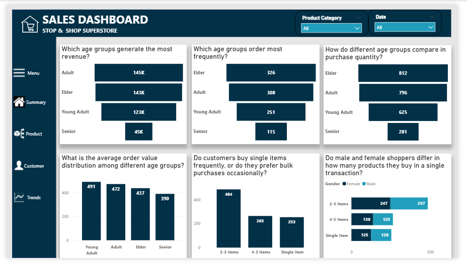

# Stop & Shop Supermarket Sales Report

## Introduction

In today’s competitive retail landscape, data-driven decision-making is no longer optional, it’s essential. 
This comprehensive Stop & Shop Supermarket sales report provides actionable insights that bridge the gap between raw numbers and strategic decision-making.

This report uncovers:
- Best-selling products and revenue drivers
- Customer purchasing habits by age, gender and volume
- Seasonal trends impacting sales

## Problem Statement

Despite having access to transactional sales data, the business lacks actionable insights to:
1. Prioritize High-Value Products 
2. Target Customer Segments Effectively
3. Anticipate Demand Fluctuations
4. Maximize Transaction Value
   
## Objectives
1.	Identify Top-Performing Categories – Determine which products drive revenue vs. volume.
2.	Analyse Customer Segments – Uncover spending differences by age and gender.
3.	Track Seasonal Trends – Pinpoint peak months and low-demand periods.
4.	Optimize Purchasing Patterns – Improve revenue by increasing items per transaction.

## Data Sourcing

This dataset was acquired from my Data Analytics Instructor as part of a structured learning exercise. It was provided in an Excel file and contained transactional records for analysis, ensuring real-world relevance while maintaining controlled complexity.

Fact & Dimension Tables 

  
                          

## Skills Demonstrated

- Data Cleaning: Checked and removed duplicates and corrected data types.
- Data Transformations: Created conditional columns (Age Group, Season and purchasing pattern) and generated a custom Date table with columns like Day of Week, Month name, Quarter, etc.
- DAX Measures: Created DAX measures to calculate the total revenue, total quantity sold and total product category.
- Page Navigation: I used buttons and the page navigation feature to enable one to move between pages.
- Modelling: I used a star schema to establish relationships between the fact and dimension tables.

## Modelling

I used a star schema mkdel with one fact table connected to three dimension tables. 
The fact table holds all sales transactions, while the dimension tables (Customer, Product, and Date) provide details about each sale and customer. 

  

## Visualization

The report consists of four pages
1. Summary page
2. Product page
3. Customer page
4. Trends page

You can interact with the report [Here](https://app.powerbi.com/groups/me/reports/007f26ba-71de-497c-bf11-69a1ae5b1728/e941dd1f718e3b0bb417?experience=power-bi)

## Analysis

### Summary

  

The store generated $456K in total revenue and sold 2,514 units across 1,000 customers.

Sales peaked in May, followed by October and December, with winter being the busiest season.

### Product 
  

Electronics were the top revenue generator, suggesting higher-priced sales. 
However, clothing had the most units sold, showing strong demand for affordable items. Beauty products maintained steady sales year-round.

Clothing sales were especially strong in winter, likely due to seasonal needs.

### Customer 
  

The store’s customers fell into four age groups: young adults, adults, elders, and seniors.

Adults contributed the most to revenue, indicating higher spending power.

Elders purchased the most items, possibly due to bulk buying or discounts.

Young adults and seniors had smaller but consistent purchasing habits.

With 1,000 total customers, there’s room to analyze repeat buyers for loyalty trends.

### Trends 
  

May was the strongest sales month, followed by October and December, likely tied to holidays.

Winter was the peak season, with clothing driving sales. Weekends and early weekdays performed best—Saturday and Monday had the highest sales.

## Recommendation

1. Boost Electronics Sales – Highlight high-margin electronics during peak seasons (May, Oct, Dec) with bundled offers and strategic store placement.

2. Gender-Specific Promotions – Target women with beauty-clothing combos and men with tech accessory deals to align with buying trends.

3. Capitalize on May’s Peak Sales – Run a promotion in May with spring discounts and pre-summer clearance to maximize the top sales month.

4. Increase Basket Size – Encourage larger purchases by training staff to suggest add-ons and placing small impulse items near checkout.

**Bonus Tip** – Test one strategy per quarter, starting with low-cost basket-building for quick wins.

## Conclusion

This analysis revealed:
- Electronics generate the highest revenue despite similar sales volume to other categories.
- May and Winter are peak periods, while September struggles.
- 48% of shoppers buy 2-3 items; upselling could boost revenue by $13K/year.

This analysis transformed raw sales data into actionable business insights. The process reinforced how data-driven decisions outperform gut feelings.

